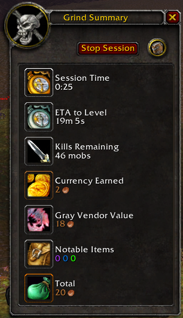
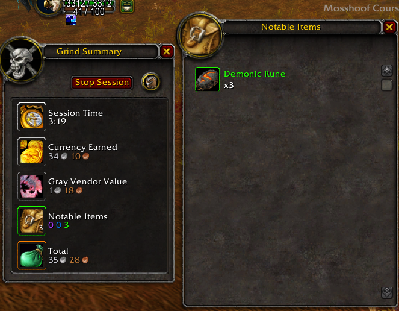
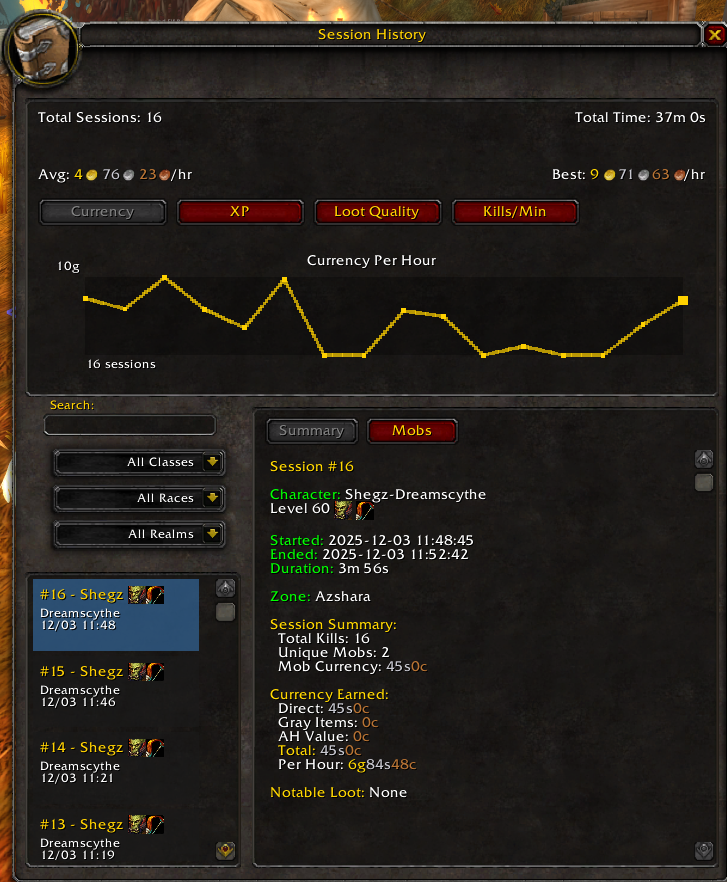
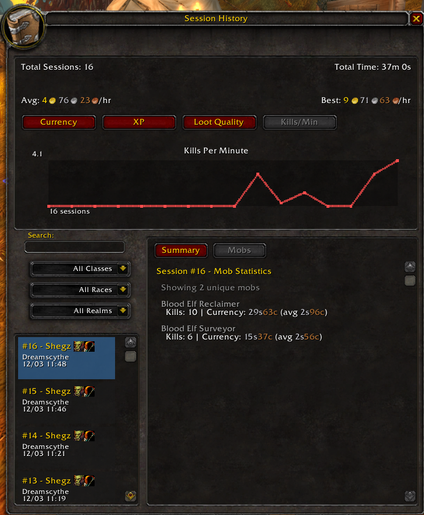
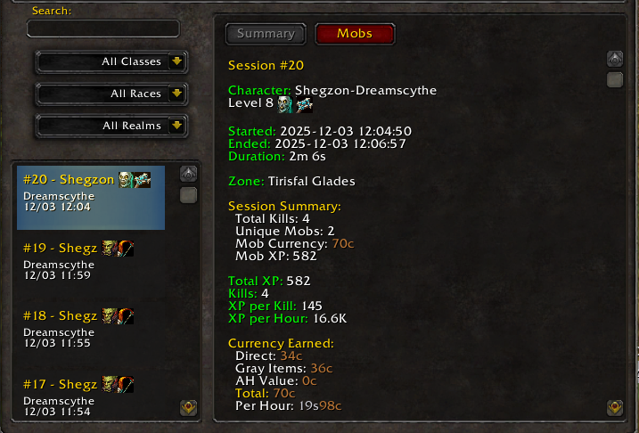

# GrindCompanion

<div align="center">

**A comprehensive World of Warcraft Classic Era addon for tracking grinding sessions, analyzing efficiency, and maximizing your farming profits.**

[](https://worldofwarcraft.com/en-us/wowclassic)
[](https://github.com/anthonygauthier/GrindCompanion)
[](LICENSE)

</div>

---

## 📋 Overview

GrindCompanion is a lightweight yet powerful addon for WoW Classic Era that helps you optimize grinding sessions. Track XP/hour, gold/hour, mob statistics, and loot in real-time with interactive graphs and comprehensive session history.

### Key Features

- **Real-Time Tracking** - Live ETA to level, kills remaining, and currency earned
- **Interactive Analytics** - Four graph types with clickable data points and trend analysis
- **Session History** - Unlimited persistent storage with advanced filtering
- **Mob Statistics** - Per-mob tracking with currency, XP, and highest quality drops
- **Multi-Character Support** - Filter by character, class, race, and realm
- **Smart Loot Tracking** - Automatic vendor values and AH pricing (with Auctionator)

### Screenshots

<div align="center">

**Live Session Tracking - Leveling Mode**



*Real-time display showing XP tracking, estimated time to level, and kills remaining*

---

**Live Session Tracking - Max Level Mode**



*Max level display focusing on currency and loot tracking*

---

**Session History & Analytics**



*Comprehensive session browser with interactive graphs and detailed statistics*

---

**Detailed Mob Tracking**



*Per-mob statistics showing kills, currency, XP, and highest quality drops*

---

**Multi-Character Support**



*Filter and compare sessions across multiple characters with race/class icons*

</div>

---

## 🚀 Quick Start

### Installation

1. Download the latest release
2. Extract to `World of Warcraft\_classic_era_\Interface\AddOns\`
3. Restart WoW or `/reload`
4. Look for the minimap button or type `/gc`

### Basic Usage

```
/gc start    - Begin tracking
/gc stop     - End session and save
/gc sessions - View history and analytics
/gc          - Show current stats
```

**Minimap Button:** Left-click for menu, drag to reposition

---

## 📊 What Makes It Different?

| Feature | GrindCompanion | Basic Trackers |
|---------|----------------|----------------|
| Interactive Graphs | ✅ 4 types with clickable points | ❌ Text only |
| Per-Mob Analytics | ✅ Detailed stats + highest drops | ❌ Aggregate only |
| Session History | ✅ Unlimited with filtering | ⚠️ Limited |
| Multi-Character | ✅ Filter by class/race/realm | ⚠️ Basic |
| AH Integration | ✅ Auctionator API | ❌ Manual |
| Adaptive UI | ✅ Leveling/max-level modes | ❌ Static |

---

## 📚 Documentation

- **[Features Guide](docs/FEATURES.md)** - Detailed feature descriptions and UI elements
- **[Commands Reference](docs/COMMANDS.md)** - Complete command list and usage examples
- **[Troubleshooting](docs/TROUBLESHOOTING.md)** - Common issues and solutions
- **[Development](docs/DEVELOPMENT.md)** - Architecture, data structures, and contributing
- **[FAQ](docs/FAQ.md)** - Frequently asked questions

---

## 🔌 Integration

**Auctionator Support (Optional):** Install [Auctionator](https://www.curseforge.com/wow/addons/auctionator) for automatic AH price estimates on green/blue/purple items and cloth.

---

## 🎯 Use Cases

- **Gold Farming** - Compare spots by gold/hour, track mob returns, monitor AH values
- **Leveling** - Optimize routes with XP/hour trends, real-time ETA, zone comparisons
- **Rare Farming** - Track highest drops per mob, analyze loot quality trends
- **Multi-Character** - Compare efficiency across characters and classes

---

## 🛠️ Configuration

Press `Esc` → Interface → AddOns → GrindCompanion to:
- Toggle visibility of display rows
- Hide/show minimap button
- Customize your tracking experience

---

## 📜 License

MIT License - see [LICENSE](LICENSE) file for details.

---

## 📞 Support

- **Issues/Features:** [GitHub Issues](https://github.com/anthonygauthier/GrindCompanion/issues)
- **Contributing:** See [CONTRIBUTING.md](CONTRIBUTING.md)

**Enjoying GrindCompanion?** Star the repo and share with fellow grinders!
